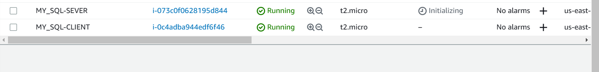
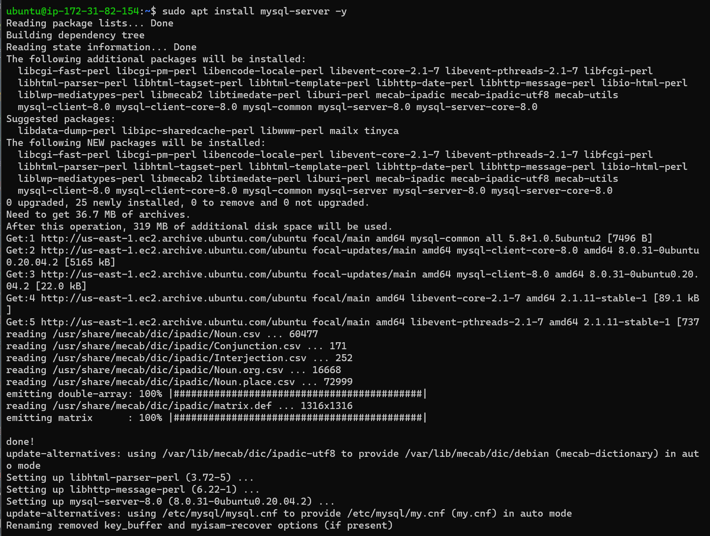
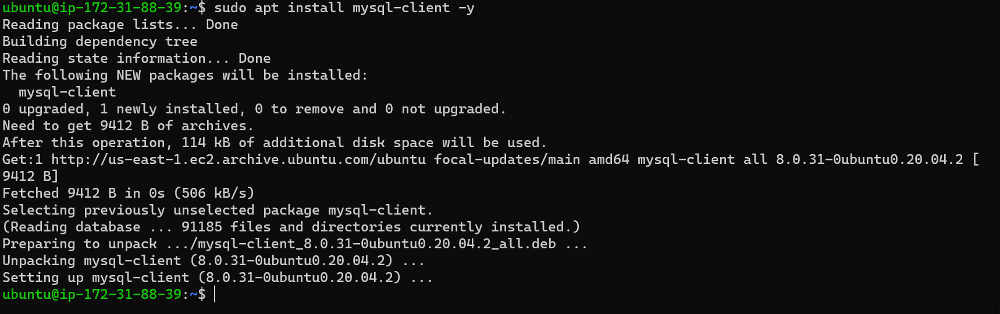
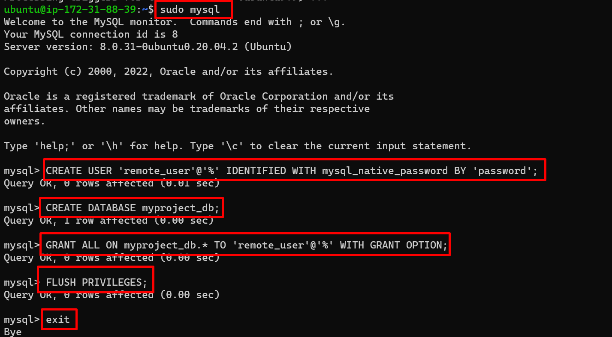
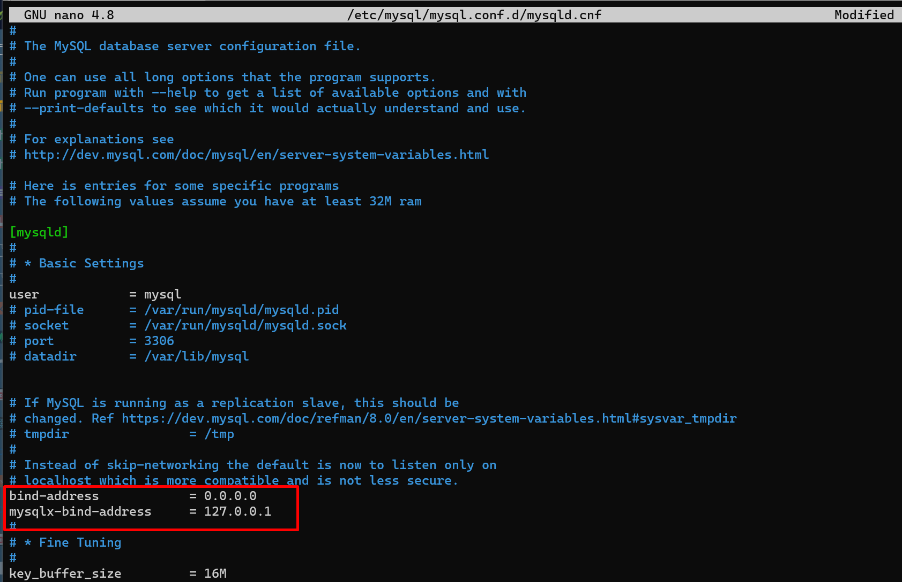
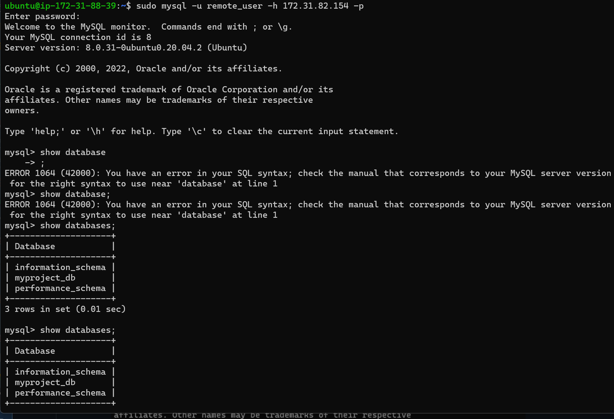

## IMPLEMENTING A CLIENT-SERVER ARCHITECTURE USING A MYSQL RELATIONAL DATABASE MANAGEMENT SYSTEM

###  Step 1 - Create the instance on AWS
Launch two ubuntu EC2 instances in AWS and name them: mysql server and mysql client respectively.

### Step 2 - Update the repository
Use the command below to update the repository of the Ubunttu OS
`sudo apt update && sudo apt upgrade -y` 

### Step 3 - Installing MySQL Server
Install SQL Server software on the EC2 instance labelled MySQL Server by running the command below.

`sudo apt install mysql-server -y`

### Step 3 - Installing MySQL Client
On the second  EC2 instance labelled  MySQL Client, install MySQL Client software with the command below

`sudo apt install mysql-client -y`

### Step 4 - Cnfigure MySQL Client EC2 instance to allow port 3306
Before you can receive mysql client traffic on your mysql server, you need make sure your security group settings on AWS allows port 3306 traffic - the default MySQL server TCP port. For extra security, do not allow all IP addresses to reach your mysql server.

### Step 5 - Creating Database on MySQL Server
For mysql client to gain remote access to mysql server, we need to create and database and a user on mysql server.

 - Open the MySQL console by typing:

`sudo mysql`

-  Create the remote user with this following command:

`CREATE USER 'remote_user'@'%' IDENTIFIED WITH mysql_native_password BY 'password';`

- Create database with:

`CREATE DATABASE myproject_db;`

- Then grant privileges to remote_user:

`GRANT ALL ON myproject_db.* TO 'remote_user'@'%' WITH GRANT OPTION;`

- Finally, flush privileges and exit mysql:

`FLUSH PRIVILEGES;`

*This is a good practice that will free up any memory that the server cached as a result of the preceding CREATE USER and GRANT statements.*

- Then exit with the exit command

### Step 6 - Configure the address
After creating the user and database, configure MySQL server to allow connections from remote hosts.

Use the command below:

`sudo nano /etc/mysql/mysql.conf.d/mysqld.cnf`

By default, this value is set to 127.0.0.1, meaning that the server will only look for local connections. In the text editor, replace the old bind-address from ‘127.0.0.1’ to ‘0.0.0.0’ then save and exit. (CTRL + X, Y, then ENTER). This gives access to an external IP address.

### Step 7 - Restart the Server
Restart mysql server with: 
`sudo systemctl restart mysql`

### Step 8 - Connect to the server remotely
Then from msql client, connect remotely to the mysql server Database Engine without using SSH. You must use mysql utility to perform this action.

Type: `sudo mysql -u remote_user -h 172.31.95.168 -p` and enter password for the user password.

### Step 9 - Check  for connectivity
Check that you have successfully connected to a remote MySQL server and can perform SQL queries:

`Show databases;`

Congratulations!!! You have deployed a fully functional MySQL Client-Server set up.